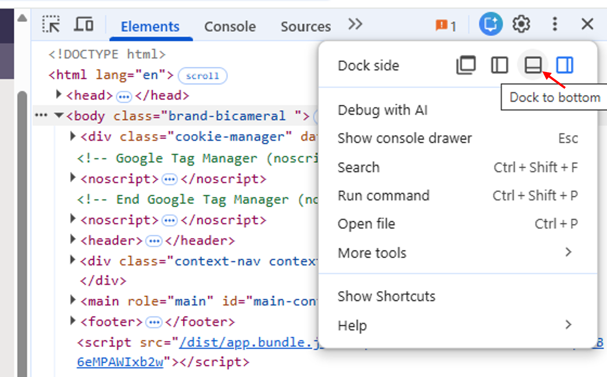
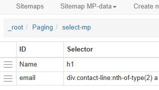

:::::::::::::::::::::::::::::::::::::: questions 

- How can I get started scraping data off the web?
- How do I assess the most appropriate method to scrape data?

::::::::::::::::::::::::::::::::::::::::::::::::

::::::::::::::::::::::::::::::::::::: objectives

After completing this episode, participants should be able to...

- Understand the different tools for accessing web page data
- Use the WebScraper tool to extract data from a web page
- Assess the appropriate method for gathering the required data
::::::::::::::::::::::::::::::::::::::::::::::::

# Using the Web Scraper Chrome extension

Now we are finally ready to do some web scraping using Web Scraper Chrome extension. If you haven’t it installed on your machine, please refer to the [Setup instructions](/learners/setup.md).

For this lesson, we will again be using the UK Members of Parliament webpages. We are interested in scraping a list of MPs and their constituencies with the help of Web Scraper.

First, let's focus our attention on the first webpage with the [list of MPs](https://members.parliament.uk/members/commons).  
We are interested in downloading the list of MP's names and their constituency.

{alt="Screenshot of UK MP list webpage"}

There are two ways of using Web Scraper, either using the Wizard GUI or using selectors in the developer tools. The wizard gives an easy to use interface but may be less flexible and doesn't provide the ability to customise that is possible using the developer tools.

## Using the Web Scraper wizard
With the extension installed the Wizard window can be opened by selecting the *Web Scraper* icon on the browser toolbar:

{alt="Screenshot of Web Scraper wizard dialog"}

The wizard allows you to select any links to navigate to other pages. In our example we don't need to do this so we will select *Skip*
In the *Page Navigation Type* tab, select whether to make selections from the listing page or whether to open links

- We will use the *Listing page* option 
- image?
- Select Continue - this will auto-generate selectors and give a preview of the data

The image below shows an example of the data which is automatically extracted from this web page without any selection:

{alt="Screenshot of automatically scraped MP data"}

Note that this has only gathered the names of MPs for one page, collecting about 20 entries out of a total of 650. The next section *Pagination & Scroll* allows multiple pages to be selected for scraping:

- Choose *Select Next Page button* 
- Select the appropriate means of selecting more pages. This could be either a set of numbered pages or a 'next page' button. Several buttons can be selected if needed.
- On completion click the green *Done selecting* button.

{alt="Screenshot of pagination selection"}

On selection of the *Finish* button the dialog will show that scraper configuration is ready and the *Scrape the page* button can be selected.

Now data has been scraped for all 650 MPs from all pages:

{alt="Screenshot showing data from multiple pages"}

The data scraped can now be downloaded as either a .xlsx or .csv file.


## Using Web Scraper with the browser developer console

- Open the *Developer Tools* and open the *Web Scraper* tab
   - If the developer tools are docked at the side of the screen use the three dots a the top right of the dialog and select the option to dock at the bottom (see below)

   {alt="Dialog showing how to select developer tools docking position"}

The Web Scraper extension works on a "Sitemap". The previous exercise will already have created a sitemap and this will be listed in the opening window on the tab.  Alternatively, a new sitemap can be created:
- Select Create new sitemap-> Create Sitemap
   - Add a *Sitemap name* and *Start URL* for the webpage you wish to scrape
   - Click *Create Sitemap*

When a sitemap has been created then *selectors* can be created to govern how the webpage will be scraped. For a webpage created by the Wizard, the selectors generated automatically can be inspected, edited and new selectors created as required.

It is a good idea to spend some time navigating the website and taking a look at the underlying code, using the *Inspect* facility, to decide on the best way to set up the selectors. The code will show the type of elements underlying the items on the webpage and may help with the 

The MP information data is spread across several pages. The first selector that we will create will enable the scraper to automatically scrape multiple pages.

- Select the *Add new selector* button. In the resulting dialog:
   - Choose an Id for the selector, e.g. Paging
   - The type menu offers a drop down menu of available selectors. In this case, we will choose the *Pagination* selector
   - Use the *Select* button to select the relevant elements on the webpage. In this case the pagination uses the numbered boxes at the top or bottom of the page. More than one selection can be made by using Shift+Enter. In the example shown below, just two pages have been selected.
   - The *Element Preview* button can be used to check that the correct items have been selected.
   - The *Data Preview* button will show the data that will result from this scraping operation.

{alt="Screenshot of creating pagination selector"}

The information to be scraped is on the page navigated to by selecting one of the MP list boxes. We will set up a selector to select each box on the page. Note that, because the pagination selector has already been set up, it is only necessary to do this for one page.

The next information to be selected is on the page arrived at by the links selected in the previous step. By clicking on the selector just created in the list it can be seen that the link breadcrumbs update and the list of selector IDs is now empty:

- Select the Paging row in the dialog
- Create a new selector as before, this time choosing a *Link* selector
- When using the *Select* button all MP list boxes can be selected by clicking on a second box.
- Check the *Multiple* option

{alt="Screensho of creating link selector"}

Again, the next information to be selected is on the page arrived at by the links selected in the previous step. By clicking on the select-mp selector in the list it can be seen that the link breadcrumbs have again been updated:

{alt="Screenshot showing link breadcrumbs"}

We now need to navigate to one of the MP pages by clicking on one of the list boxes. The required data can now be gathered by adding more selectors.

- Create a *Text* type selector
- Select the field containing the name

{alt="Screenshot of text selector creation"}

We can use the same method to create a selector for the email address. There should now be two selectors within the select-mp page.

{alt="Name and email selectors"}

The sitemap is now ready for scraping. Select *Sitemap name -> Scrape*. The Request interval and Page load delay options can be left at the default 2000ms. Clicking the *Start scraping* button will start the scraping process.  A window will open, showing the pages being accessed in the scraping process.

On completion of scraping it may be necessary to click the *Refresh* button in order to view the data. A table will be displayed showing the data extracted. The *Sitemap name -> Export Data* option allows export in either .xlsx or .csv format.

[MP-data.xlsx](data/MP-data.xlsx) is the file downloaded after the scraping exercise described above.  On examination of this file, it can be seen that all of the MP's names have been extracted but the list of email addresses is incomplete.

:::::::::::::::::::::::::::::::::::::challenge

[MP-data.xlsx](data/MP-data.xlsx) is the file downloaded after the scraping exercise described above.  On examination of this file, it can be seen that all of the MP's names have been extracted but the list of email addresses is incomplete.

Why do you think that there are some email addresses missing? 
- Take a look at the code for the email address information.
- Compare the information for MPs where the email address was found and where it was not

:::::::::::::::::: solution

The code for the email address on the [Ms Diane Abbott page](https://members.parliament.uk/member/172/contact) is shown below:

```html
(...)
<div class="col-md-7">
   <div class="contact-line">
      <span class="label">Phone Number:</span> 
      <a href="tel:020 7219 4426">020 7219 4426</a>
   </div>
   <div class="contact-line">
      <span class="label">Email Address:</span> 
      <a href="mailto:diane.abbott.office@parliament.uk"> diane.abbott.office@parliament.uk</a>
   </div>                   
</div>
(...)
```
If we look at the selector code: "div.contact-line:nth-of-type(2) a" we can see that looks like it has picked out the second "contact-line" class and then used the text from the "a" tag.  If we look at the similar section of code for an MP with just an email address in the contacts (no phone number) then we can see that a selector which searches for the second element will not yield a result.

Web Scraper includes some extra functionality which allows a more explicit search to be carried out using JQuery selectors.  It is beyond the scope of this lesson to cover this in detail. There is information in the Web Scraper [JQuery Selectors documentation](https://webscraper.io/tutorials/jquery-contains-selector).

We will look at how to use the *contains* option to extract the complete list of email addresses.

:::::::::::::::::::::::::::

::::::::::::::::::::::::::::::::::::::::::::::

## Using JQuery to refine selector options

The JQuery *contains* value can be used to target elements which contain a particular string. Inspection of the "contact-line" class shows that the email address item contains the string "Email Address". The selector can be edited manually to 

div.contact-line:contains('Email Address') a

This will now only target the contact-line elements which contain the "Email Address" text.

Inspection of the [new downloaded spreadsheet](data/MP-data-complete-emails.xlsx) shows that all of the emails have now been extracted.

:::::::::::::::::::::::::::::::::::: challenge

Modify your sitemap to also gather the phone number information for each MP

::::::::::::::::::::::::::::::::::::::::::::::


::::::::::::::::::::::::::::::::::::: keypoints 

- Data that is relatively well structured (in a table) is relatively easily to scrape. 
- More often than not, web scraping tools need to be told what to scrape.
- JQuery can be used to define more precisely what information is to be scraped.

::::::::::::::::::::::::::::::::::::::::::::::::

[r-markdown]: https://rmarkdown.rstudio.com/
