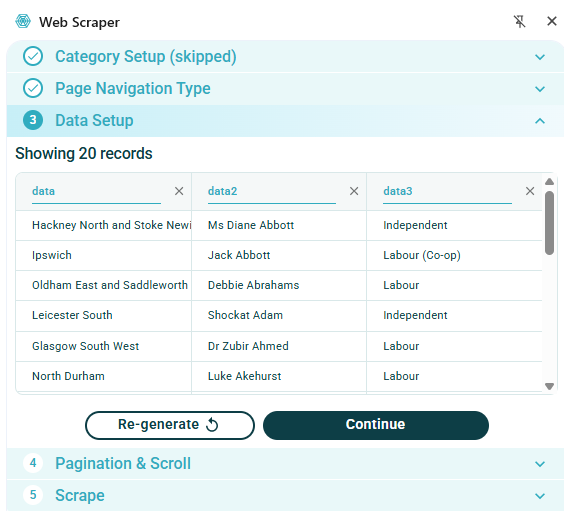

:::::::::::::::::::::::::::::::::::::: questions 

- How can I get started scraping data off the web?
- How do I assess the most appropriate method to scrape data?

::::::::::::::::::::::::::::::::::::::::::::::::

::::::::::::::::::::::::::::::::::::: objectives

After completing this episode, participants should be able to...

- Understand the different tools for accessing web page data
- Use the WebScraper tool to extract data from a web page
- Assess the appropriate method for gathering the required data
::::::::::::::::::::::::::::::::::::::::::::::::

# Using the Web Scraper Chrome extension

Now we are finally ready to do some web scraping using Web Scraper Chrome extension. If you haven’t it installed on your machine, please refer to the [Setup instructions](/learners/setup.md).

For this lesson, we will again be using the UK Members of Parliament webpages. We are interested in scraping a list of MPs and their constituencies with the help of Web Scraper.

First, let's focus our attention on the first webpage with the [list of MPs](https://members.parliament.uk/members/commons).  
We are interested in downloading the list of MP's names and their constituency.
{alt="Screenshot of UK MP list webpage}

Two methods to use Web Scraper, either using the Wizard GUI or using selectors in the developer tools

## Using the Web Scraper wizard
- Select Web Scraper icon - opens Wizard window:
{alt="Screenshot of Web Scraper wizard dialog"}

The wizard allows you to select any links to navigate to other pages. In our example we don't need to do this so we will select *Skip*
- In the Page Navigation Type tab, select whether to make selections from the listing page or whether to open links
   - We will use the *Listing page* option 
   - image?
   - Select Continue - this will auto-generate selectors and give a preview of the data
The image below shows an example of the data which is automatically extracted from this web page without any selection:
{alt="Screenshot of automatically scraped MP data"}

Note that this has only gathered the names of MPs for one page, collecting about 20 entries out of a total of 650. The next section *Pagination & Scroll*
- Choose *Select Next Page button* and then select the means of selecting more pages. This could be either a set of numbered pages or a 'next page' button. Several buttons can be selected if needed and the green *Done selecting* button should be clicked on completion
{alt="Screenshot of pagination selection"}

On selection of the *Finish* button the dialog will show that scraper configuration is ready and the *Scrape the page* button can be selected.
Now data has been scraped for all 650 MPs from all pages:
{alt="Screenshot showing data from multiple pages"}
The data scraped can now be downloaded as either a .xlsx or .csv file.

## Using Web Scraper with browser developer console

- Open developer tools and open the Web Scraper tab
- Select Create new sitemap
   - Add title and landing page
   - Click Create Sitemap

::::::::::::::::::::::::::::::::::::: keypoints 

- Data that is relatively well structured (in a table) is relatively easily to scrape. 
- Tools may be available on a web page which enable data to be downloaded directly.

::::::::::::::::::::::::::::::::::::::::::::::::

[r-markdown]: https://rmarkdown.rstudio.com/
