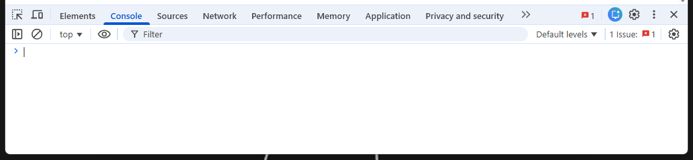

:::::::::::::::::::::::::::::::::::::: questions 

- What’s behind a website, and how can I extract information from it?
- How can I find the code for a specific element on a web page?

::::::::::::::::::::::::::::::::::::::::::::::::

::::::::::::::::::::::::::::::::::::: objectives

After completing this episode, participants should be able to...
- Identify the structure and key components of an HTML document.
- Explain how to use the browser developer tools to view the underlying html content of a web page
- Use the browser developer tool to find the html code for specific items on a web page

::::::::::::::::::::::::::::::::::::::::::::::::

## Introduction

TODO - write proper opening paragraph

Here, we’ll revisit some of those core ideas to build a more hands-on understanding of how content and data are structured on the web. 
We’ll start by exploring what HTML (Hypertext Markup Language) is and how it uses tags to organize and format content.
Then, we’ll look at how to view the HTML source code for a web page and look at how browser developer tools can be used to search for specific elements on a webpage.

## HTML quick overview

All websites have a Hypertext Markup Language (HTML) document behind them.
Below is an example of HTML for a very simple webpage that contains just three sentences.
As you look through it, try to imagine how the website would appear in a browser.

```html
<!DOCTYPE html>
<html>
<head>
<title>Sample web page</title>
</head>
<body>
<h1>h1 Header #1</h1>
<p>This is a paragraph tag</p>
<h2>h2 Sub-header</h2>
<p>A new paragraph, now in the <b>sub-header</b></p>
<h1>h1 Header #2</h1>
<p>
This other paragraph has two hyperlinks,
one to <a href="https://carpentries.org/">The Carpentries homepage</a>,
and another to the
<a href="https://carpentries.org/workshops/past-workshops/">past workshops</a> page.
</p>
</body>
</html>
```

If you save that text in a file with a .html extension —using a simple text editor like Notepad on Windows or TextEdit on macOS— and open it in your web browser, the browser will interpret the markup language and display a nicely formatted web page.

{alt="Screenshot of a simple website with the previews HTML"}

When you open an HTML file in your browser, what it's really doing is reading a structured document made up of **elements**, each marked by **tags** inside angle brackets (< and >).
For instance, the HTML root element, which delimits the beginning and end of an HTML document, is identified by the `<html>` tag.

Most elements have both an opening tag and a closing tag, which define the start and end of that element.
For example, in the simple website we looked at earlier, the head element begins with `<head>` and ends with `</head>`.

Because elements can be nested inside one another, an HTML document forms a tree structure, where each element is a node that can contain child nodes, as illustrated in the image below.

{alt="Screenshot of a simple website with the previews HTML"}

Finally, we can define or modify the behavior, appearance, or functionality of an element using **attributes**.
Attributes appear inside the opening tag and consist of a name and a value, formatted like `name="value"`.

For example, in the simple website, we added a hyperlink using the `<a>...</a>` tags.
To specify the destination URL, we used the `href` attribute inside the opening `<a>` tag like this: `<a href="https://carpentries.org/workshops/past-workshops/">past workshops</a>`.

Here is a non-exhaustive list of common HTML elements and their purposes:

- `<hmtl>...</html>`: The root element that contains the entire document.
- `<head>...</head>`: Contains metadata such as the page title that the browser displays.
- `<body>...</body>`: Contains the content that will be shown on the webpage.
- `<h1>...</h1>, <h2>...</h2>, <h3>...</h3>`: Define headers of levels 1, 2, 3, and so on.
- `<p>...</p>`: Represents a paragraph.
- `<a href="">...</a>`: Creates a hyperlink; the destination URL is set with the href attribute.
- ``: Embeds an image, with the image source specified by `src` and alternative text provided by `alt`. It doesn't have an opening tag.
- `<table>...</table>, <th>...</th>, <tr>...</tr>, <td>...</td>`: Define a table structure, with headers (`<th>`), rows (`<tr>`), and cells (`<td>`).
- `<div>...</div>`: Groups sections of HTML content together.
- `<script>...</script>`: Embeds or links to JavaScript code.

In the list above, we mentioned some attributes specific to hyperlink (`<a>`) and image (``) elements, but there are also several global attributes that most HTML elements can have.
These are especially useful for identifying elements when web scraping:

- `id=""`: Assigns a unique identifier to an element; this ID must be unique within the entire HTML document. 
- `title=""`: Provides extra information about the element, shown as a tooltip when the user hovers over it.
- `class=""`: Applies a common styling or grouping to multiple elements at once.

::::::::::::::::::::::::::::::::::::: spoiler

### Something about CSS

- add some brief text about CSS to explain the use of classes

::::::::::::::::::::::::::::::::::::::::::::::::

To summarize: **elements** are identified by **tags**, and **attributes** let us assign properties or identifiers to those elements.
Understanding this structure will make it much easier to extract specific data from a website.

## Inspecting the web page source code

We will use the HTML code that describes this very page you are reading as an example. By default, a web browser
interprets the HTML code to determine what markup to apply to the various elements of a document, and the code is
invisible. To make the underlying code visible, all browsers have a function to display the raw HTML content of
a web page.

::::::::::::::::::::::::::::::::::::: challenge
## Display the source of this page

Using your favourite browser, display the HTML source code of this page.

Tip: in most browsers, all you have to do is do a right-click anywhere on the page and select the "View Page Source"
option ("Show Page Source" in Safari).

Another tab should open with the raw HTML that makes this page. See if you can locate its various elements, and
this challenge box in particular.

::::::::::::::::::::::::::::::::::::::::::::::::

::::::::::::::::::::::::::::::::::::: callout
## Using the Safari browser TODO - check this is correct

If you are using Safari, you must first turn on the "Develop" menu in order to view the page source, and use the
functions that we will use later in this section. To do so, navigate to Safari > Preferences and in the Advanced tab
select the "Show Develop in menu bar" option. Note: In recent versions of Safari you must first turn on the "Develop" 
menu (in Preferences) and then navigate to `Develop > Show Javascript Console` and then click on the "Console" tab.

::::::::::::::::::::::::::::::::::::::::::::::::

The HTML structure of the page you are currently reading looks something like this (most text and elements have
been removed for clarity):
TODO: update to new page
```html
<!doctype html>
<html lang="en">
  <head>
    (...)
    <title>{{page.title}}</title>
  </head>
  <body>
	 (...)
  </body>
</html>
```

We can see from the source code that the title of this page is in a `title` element that is itself inside the
`head` element, which is itself inside an `html` element that contains the entire content of the page.

Say we wanted to tell a web scraper to look for the title of this page, we would use this information to indicate the
_path_ the scraper would need to follow as it navigates through the HTML content of the page to reach the `title`
element. We can search for specific items in the source page code using the built in developer console.

::::::::::::::::::::::::::::::::::::: callout
## Display the console in your browser TODO - check Safari

- In Firefox, use the *More Tools > Web Developer Tools* menu item.
- In Chrome, use the *More tools > Developer tools* menu item.
- In Safari, use the *Develop > Show Error Console* menu item. If your Safari browser doesn't have a Develop menu,
  you must first enable this option in the Preferences, see above.
::::::::::::::::::::::::::::::::::::::::::::::::

Here is how the console looks like in the Firefox browser:



By default the console will probably open in the *Console* tab. For now, don't worry too much about error messages if you see any in the console when you open it. We will be using the *Elements* tab to locate specific items in the web page.

## Locate code for specific elements
To find the code for a specific item on a web page, hover over it and right click, selecting *Inspect* from the dialog displayed. This is how it looks in the Chrome browser:

{alt = "Dialog with Inspect option"}

This will automatically move to the *Elements* tab in the developer console (opening the developer console if not already open) and display the section of code for the selected element. The specific line of code for the element will be highlighted. In the example below a name was selected on the Canadian MPs webpage resulting in the code below:

{alt = "Code shown in the developer console for a selected element"}


::::::::::::::::::::::::::::::::::::: keypoints 

- Every website is built on an HTML document that structures its content.
- An HTML document is composed of elements, usually defined by an opening <tag> and a closing </tag>
- Elements can have attributes that define their properties, written as <tag attribute_name="value">.

::::::::::::::::::::::::::::::::::::::::::::::::

[r-markdown]: https://rmarkdown.rstudio.com/
